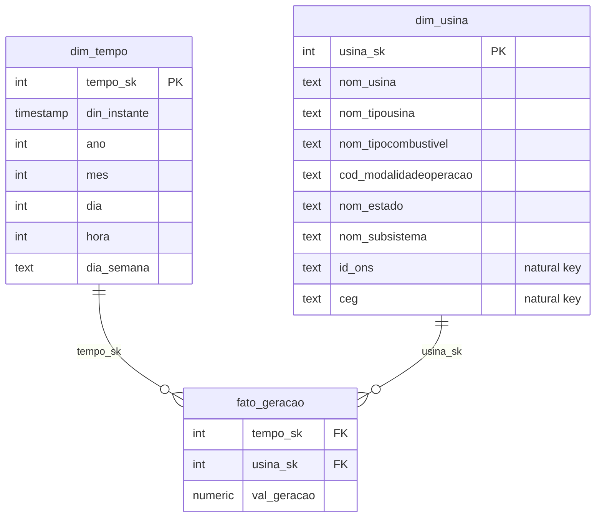

```mermaid
erDiagram
    dim_tempo ||--o{ fato_geracao : "tempo_sk"
    dim_usina ||--o{ fato_geracao : "usina_sk"

    dim_tempo {
        int tempo_sk PK
        timestamp din_instante
        int ano
        int mes
        int dia
        int hora
        text dia_semana
    }
    dim_usina {
        int usina_sk PK
        text nom_usina
        text nom_tipousina
        text nom_tipocombustivel
        text cod_modalidadeoperacao
        text nom_estado
        text nom_subsistema
        text id_ons "natural key"
        text ceg "natural key"
    }
    fato_geracao {
        int tempo_sk FK
        int usina_sk FK
        numeric val_geracao
    }
```
